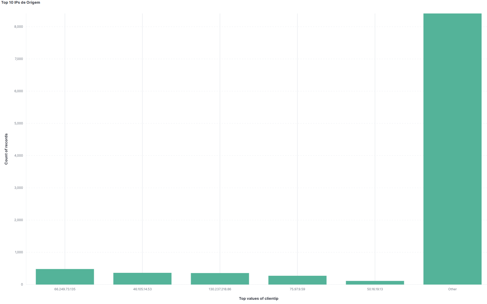
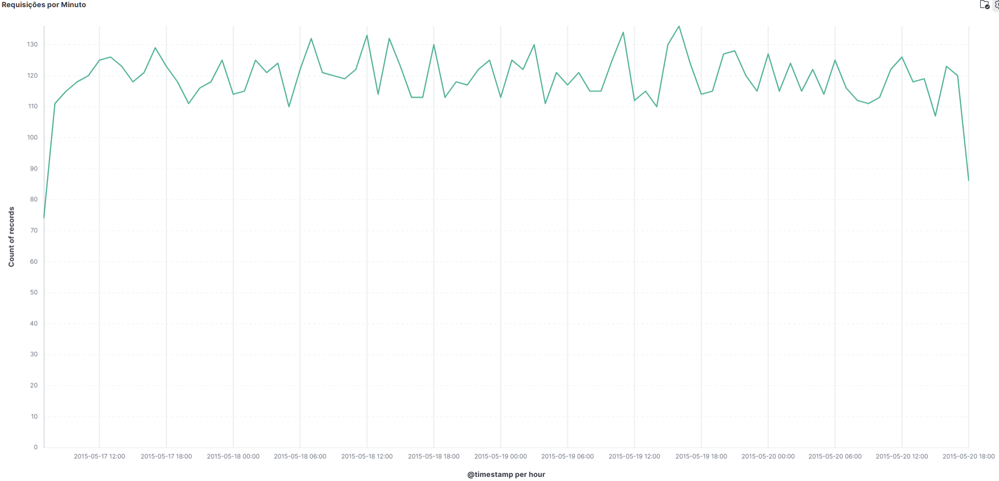
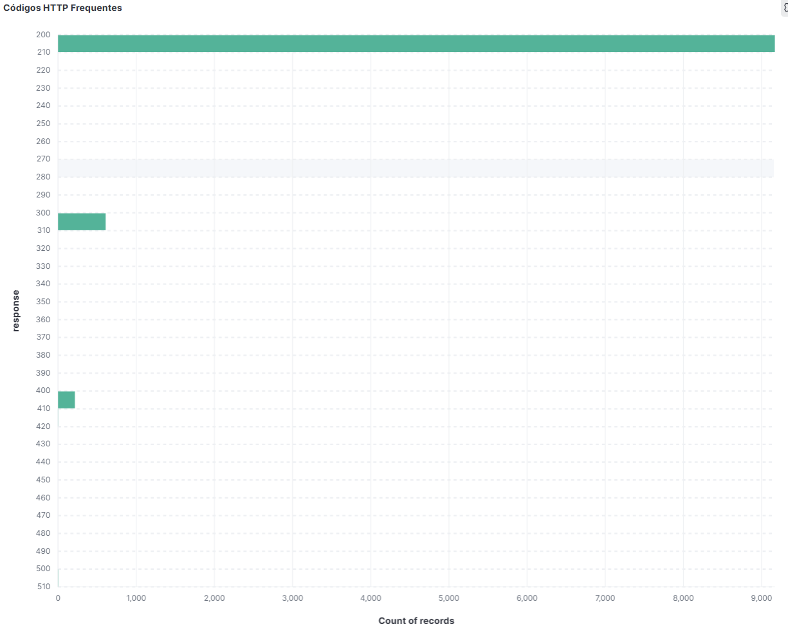
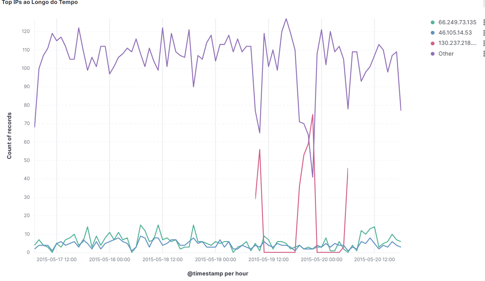
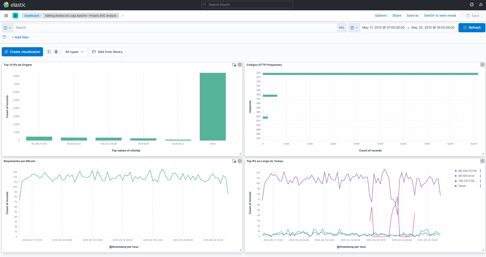

# 📊 Apache Logs – Análise SOC com ELK Stack

[]()
[]()
[]()

## 🔍 Descrição

Projeto prático simulando o dia a dia de um **Analista SOC** com foco em ingestão e visualização de logs Apache utilizando a **ELK Stack (Elasticsearch, Logstash, Kibana)**. O objetivo é identificar padrões suspeitos, IPs fora do comum e códigos HTTP que possam indicar comportamento anômalo.

---

```bash
📦 log-analysis-elk-stack/
├── kibana_dashboard/                 <- Prints das visualizações e dashboard
├── logstash.conf                     <- Configuração para ingestão dos logs
├── apache_logs_sample.log           <- Dataset analisado
└── README.md                         <- Este arquivo
```

---

## 🛠️ Tecnologias e Ferramentas

- 🔎 **Kibana** – Visualizações e dashboard interativo  
- 💾 **Elasticsearch** – Armazenamento/indexação dos logs  
- 🔧 **Logstash** – Parsing dos logs de acesso do Apache  
- 🌐 **Apache Access Logs** – Fonte de dados  
- 🐧 **Linux/Ubuntu** – Ambiente de desenvolvimento

---

## 📈 Visualizações Criadas

### 📊 Top 10 IPs de Origem  
> IPs que mais acessaram o servidor.



---

### ⏱️ Requisições por Minuto  
> Tráfego ao longo do tempo – ajuda a detectar picos de atividade.



---

### 📋 Códigos HTTP Frequentes  
> Frequência de status HTTP (200, 404, 500...).



---

### 🧠 IPs ao Longo do Tempo *(extra)*  
> Comportamento dos principais IPs em formato de linha do tempo.



---

## 🧩 Dashboard Final

> Visão consolidada com todas as visualizações em um painel dinâmico.



---

## ✅ Status do Projeto

- [x] Instalação e configuração do ELK Stack  
- [x] Parsing dos logs Apache com Logstash  
- [x] Criação de visualizações no Kibana  
- [x] Montagem do dashboard final  
- [x] Documentação e screenshots

---

## 📌 Dataset usado

🔗 [Apache Logs - Elastic Sample](https://github.com/elastic/examples/blob/master/Common%20Data%20Formats/apache_logs/apache_logs)

---

> 💡 *Este projeto demonstra minha capacidade de analisar logs em um contexto SOC, configurar pipelines com ELK Stack e montar dashboards de visualização que apoiam a detecção de atividades suspeitas em tempo real.*